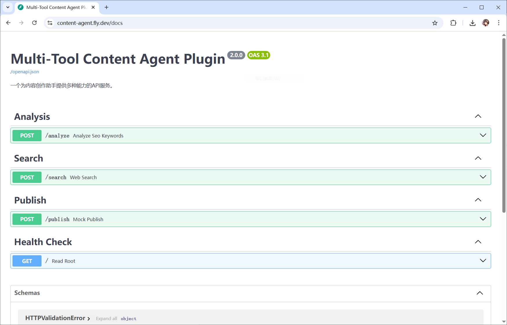
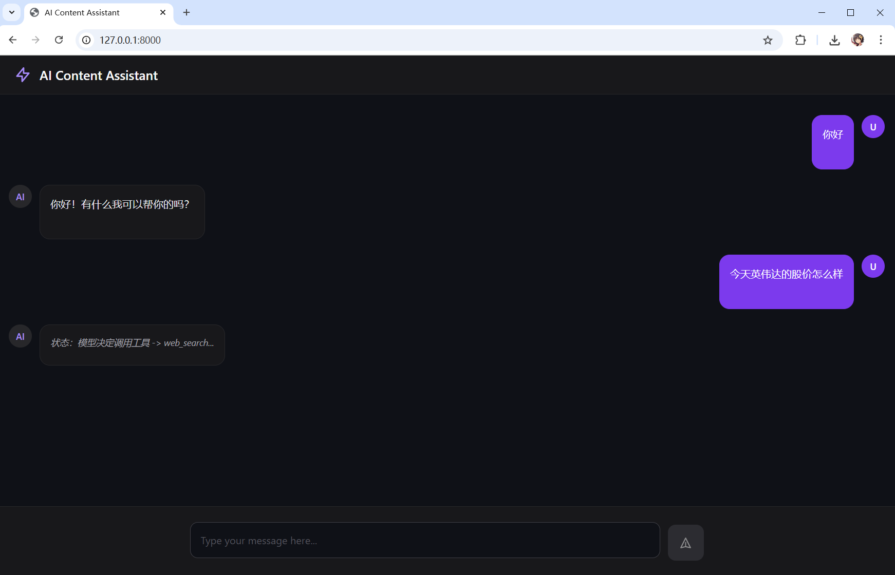

# 自动化内容创作与发布助手 - 项目图文说明

## 一、 项目概述

**项目名称**：自动化内容创作与发布助手 (AI Content Assistant)

**项目目标**：本项目旨在完成“Python程序设计期末考试”的“困难”档位要求，实现一个基于大型语言模型（LLM）的、拥有长期记忆和多工具调用能力的**网页版智能体（Agent）应用**。该智能体能够理解用户的复杂指令，通过自主思考和行动（ReAct模式），按需调用部署在云端的自定义工具集（包括信息搜集、内容分析、文章发布），最终完成一个从“构思”到“发布”的全流程自动化内容创作任务。

**核心成果**：
- **Web应用实现**：成功构建了一个功能完整、界面现代的前后端分离Web应用。
- **智能体记忆**：通过会话ID（Session ID）机制，实现了跨多轮对话的记忆功能。
- **自定义工具**：独立开发并部署了包含“网页搜索”、“SEO分析”、“模拟发布”三大功能的云端工具集，并因此获得**分数加成**。
- **MCP服务集成**：项目的Agent核心扮演了MCP（Master Control Program）的角色，负责协调LLM的“思考”与自定义工具的“行动”。

---

## 二、 技术栈

本项目采用了一系列现代化的技术栈，以实现一个健壮、高效且可扩展的全栈AI应用。

- **后端语言**: Python 3.10
- **Web框架**: FastAPI (用于构建工具API和Web服务)
- **环境管理**: Conda
- **AI模型**: 阿里云通义千问 (通过OpenAI兼容模式调用)
- **核心AI库**: `openai`
- **云平台**: Fly.io (用于部署永不休眠的工具API服务)
- **前端框架**: Vue.js 3 (通过CDN引入，用于数据驱动的UI)
- **前端渲染**:
    - `marked.js` (用于实时解析Markdown)
    - `highlight.js` (用于代码块的语法高亮)
- **版本控制**: Git & GitHub

---

## 三、 系统架构设计

本项目的系统架构遵循现代Web应用的分层设计思想，分为用户界面层、应用服务层、智能代理层和外部工具层，各层职责分明，通过API进行通信。

1.  **用户界面 (Frontend)**：用户通过浏览器与之交互的单页应用。它基于Vue.js构建，负责渲染聊天界面，并通过异步HTTP请求将用户指令发送到应用服务层。

2.  **应用服务层 (Web App Service)**：基于FastAPI构建的核心后端。它扮演“接待员”的角色：
    - 提供静态Web页面 (`/`)。
    - 提供核心聊天接口 (`/chat`)，负责管理**会话记忆**。
    - 接收前端请求，调用智能代理层进行处理，并将结果以**流式响应**返回给前端。

3.  **智能代理层 (Agent Core)**：项目的“大脑”，负责执行**ReAct（思考-行动）**循环。
    - **思考 (Reason)**: 接收完整的对话历史，通过Function Calling机制，请求LLM进行决策，判断是否需要调用工具以及如何调用。
    - **行动 (Act)**: 根据LLM的决策，通过HTTP请求，实际调用部署在云端的外部工具。
    - **观察与总结 (Observe & Summarize)**: 将工具返回的结果加入对话历史，再次请求LLM，让其基于新信息生成最终给用户的、自然的语言回复。

4.  **外部工具层 (Tools API)**：项目的“手臂”，是一个独立部署在Fly.io云平台上的多功能FastAPI应用。它提供了一系列稳定的、可被Agent调用的HTTP API端点。

**数据流转流程**：
`用户输入` -> `Vue.js前端` -> `POST /chat请求` -> `FastAPI应用服务` -> `获取/更新会话历史` -> `调用Agent核心` -> `[ReAct循环]` -> `LLM决策` -> `调用Fly.io工具API` -> `工具返回结果` -> `LLM总结` -> `流式响应` -> `Vue.js前端渲染` -> `界面显示`

---

## 四、 核心模块实现详解

### 1. 云端工具集 (`plugins`)

为了赋予Agent真实世界的能力，我们开发并部署了一个多功能的API服务。

- **技术实现**: 使用FastAPI和Pydantic模型构建，确保了API的健壮性和自动文档生成。
- **部署平台**: 选择Fly.io，因为它提供了免费且**永不休眠**的容器服务，完美解决了PaaS平台常见的冷启动超时问题。
- **核心工具**:
    - `POST /search`: 接收查询词，调用第三方`Serper API`进行实时网页搜索，返回处理后的搜索结果摘要。
    - `POST /analyze`: 接收文本和关键词，返回专业的SEO密度分析报告。
    - `POST /publish`: 接收标题和内容，模拟文章发布过程，返回一个虚构的成功URL。

### 2. 智能代理核心 (`agent`)

这是项目的“大脑”，负责所有的智能决策和调度。

- **记忆实现**: 通过在`webapp`层维护一个以`session_id`为键的字典`chat_sessions`，我们将每一轮的对话（包括用户提问和AI回答）都保存下来。每次请求时，都将该`session_id`对应的**完整历史记录**传递给Agent，从而实现了长期记忆。

- **ReAct模式实现**: 在`process_agent_request`函数中，我们实现了一个完整的ReAct循环：
    1.  **首次调用LLM (决策)**: 将包含工具定义的完整对话历史发送给LLM，让其决策是直接回答还是调用一个或多个工具。
    2.  **工具调用 (行动)**: 解析LLM返回的`tool_calls`指令，通过`call_tool`函数向云端API发起真实的HTTP请求。
    3.  **二次调用LLM (总结)**: 将工具返回的结果以`role: "tool"`的形式，追加到对话历史中，再次请求LLM。在系统提示（System Prompt）中，我们明确指示AI**必须**根据工具结果进行总结，且**不能暴露**内部工具调用的细节，从而保证了回复的自然性。

### 3. 现代化前端 (`index.html` with Vue.js)

为了提供极致的用户体验，前端采用了现代化的技术方案。

- **数据驱动UI**: 我们引入了Vue.js框架。不再需要手动操作复杂的DOM元素，我们只用维护一个`messages`数组。当数组内容变化时，Vue会自动高效地重新渲染聊天界面，代码更简洁，行为更可预测。

- **流式响应与状态更新**:
    - 后端使用FastAPI的`StreamingResponse`，Agent的每一步“思考”（状态更新）和最终答案的每一个“字”都作为数据流发送。
    - 前端使用`fetch` API的`ReadableStream`来接收数据流，并实时更新Vue的`messages`数组，实现了状态的滚动更新和最终答案的“打字机”效果。

- **Markdown与代码高亮**:
    - 使用`marked.js`库在前端实时将AI返回的Markdown文本解析为HTML。
    - 通过Vue的`watch`和`nextTick`机制，我们确保在Markdown内容被**完全渲染到DOM**之后，再调用`highlight.js`对代码块进行语法高亮，完美解决了异步渲染中的时序问题，实现了专业级的代码展示效果。

---

## 五、 项目亮点总结

- **架构完整**: 成功构建了一个包含前后端、云服务和第三方AI模型的全栈应用，架构清晰，逻辑完整。
- **深度智能化**: 不仅仅是简单的问答，Agent具备了记忆、思考、行动（调用工具）和总结的完整能力，真正实现了“智能体”的概念。
- **卓越的用户体验**: 实现了流式响应、实时状态更新、Markdown渲染和代码高亮，提供了远超普通聊天机器人的现代化交互体验。
- **工程实践价值**: 在开发过程中，成功解决了版本控制、云平台选型（Render vs Fly.io）、API认证、模板语法冲突、前端渲染时序等一系列真实世界中的工程问题，展现了强大的问题解决能力。